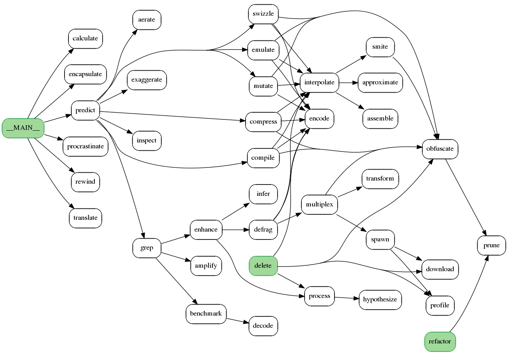

## A multi-language tool to parse source code for function definitions and calls
A call graph shows how functions call each other within a program. 
Each oval represents a function, and each arrow indicates a function call. 
In the diagram below, the main program is represented by node MAIN.  It calls 6 functions, one of which calls 9 other functions. 
 
callGraph statically generates a call graph image and displays it on screen. 
Supported languages are: awk, bash, basic, dart, fortran, go, lua, javascript, julia, kotlin, matlab, perl, pascal, php, python, R, raku, ruby, rust, scala, swift, and tcl. 
 
c/c++/java are not supported, since their complex and varied syntax requires heavy machinery. 

	Usage:
		callGraph  <files>  <options>

		If your script calls helper modules, and you want the call graph to display the modules' functions,
			list the modules explicitly on the command line:
		callGraph script.pl path/moduleA.pm path/moduleB.pm
		
	Options:
		-language <lang>           By default, filename extensions are parsed for .pl .pm .tcl .py, etc.
								   If those are not found, the first line of the script (#! shebang) is inspected.
								   If neither of those give clues, use this option to specify 'pl', 'tcl', 'py', etc
								   This option is required if a directory is scanned

		-start <function>          Specify function(s) as starting point instead of the main code.
								   These are displayed in green.
								   This is useful when parsing a large script, as the generated graph can be huge.
								   In addition, the calls leading to this function are charted.
								   Functions which are not reachable from one of the starting points
									 are not charted.
								   -start __MAIN__  can be very useful when multiple source files
									 are specified on the command line

		-ignore <regex>            Specify function(s) to ignore.
								   This is useful when pruning the output of a large graph.
								   In particular, use it to remove logging or other helper functions which are
									 called by many functions, and only clutter up the graph.
								   To ignore multiple functions, use this regex format:
									   -ignore '(abc|xyz)'

		-output <filename>         Specify an output filename
								   By default, the .png file is named according to the first filename.
								   If a filename ending in .dot is given,
									 only the intermediate .dot file is created.
								   If a filename ending in .svg is given, svg format is used
								   If a filename ending in .pdf is given, pdf format is used

		-noShow                    By default, the .png file is displayed.  This option prevents that behavior.

		-fullPath                  By default, the script strips off the path name of the input file(s).
								   This option prevents that behavior.

		-writeSubsetCode <file>    Create an output source code file which includes only the functions
									 included in the graph.
								   This can be useful when trying to comprehend a large legacy code.

		-ymlOut <file>             Create an output YAML file which describes the following for each function:
									   * which functions call it
									   * which functions it calls
								   This can be useful to create your own automation or custom formatting
								   
		-ymlIn <file>              Use your intermediate file instead of parsing source files

		-verbose                   Provides 2 additional functionalities:
								   
								   1) Displays the external scripts referenced within each function

								   2) For Perl/TCL, attempts to list the global variables
										used in each function call in the graph.
									  Global variables are arguably not the best design paradigm,
										but they are found extensively in real-world legacy scripts.

									  Perl:
										  'my' variables will affect this determination (use strict).
										  Does not distinguish between $var, @var and %var.

									  TCL:
										  Variables declared as 'global' but not used, are marked with a '*'

	Usage examples:
		callGraph  example.pl example_helper_lib.pm
		callGraph  example.py
		callGraph  <directory> -language 'go'

	Algorithm:
		callGraph uses a simple line-by-line algorithm, using regexes to find function definitions and calls.
		Function definitions can be detected easily, since they start with identifiers such as:
			'sub', 'def', 'proc', 'function', 'func', 'fun', or 'fn'
		Function definitions end with '}' or 'end' at the same nesting level as the definition.
		Function calls are a bit more tricky, since built-in function calls look exactly like user function calls.
			To solve this, the algorithm first assumes that anything matching 'word(...)' is a function call,
			and then discards any calls which do not have corresponding definitions.
		For example, Perl:
			sub funcA {
				...
				if ($x) {
					print($y);
					funcB($y);
				}
				...
			}
			sub funcB {
				...
			}
		Since this is not a true parser, the formatting must be consistent so that nesting can be determined.
		If your Perl script does not follow this rule, consider running it through 'perltidy' first.
		Also, don't expect miracles such as parsing dynamic function calls.
		Caveats aside, it seems to work well on garden-variety scripts spanning tens of thousands of lines,
			and has helped me unravel large pieces of legacy code to implement urgent bug fixes.
        
    Acknowlegements:
        This code borrows core functionality from https://github.com/cobber/perl_call_graph

    Requirements:
        GraphViz and the Perl GraphViz library must be installed:
            sudo apt install graphviz
            sudo apt install make
            sudo cpan install GraphViz
